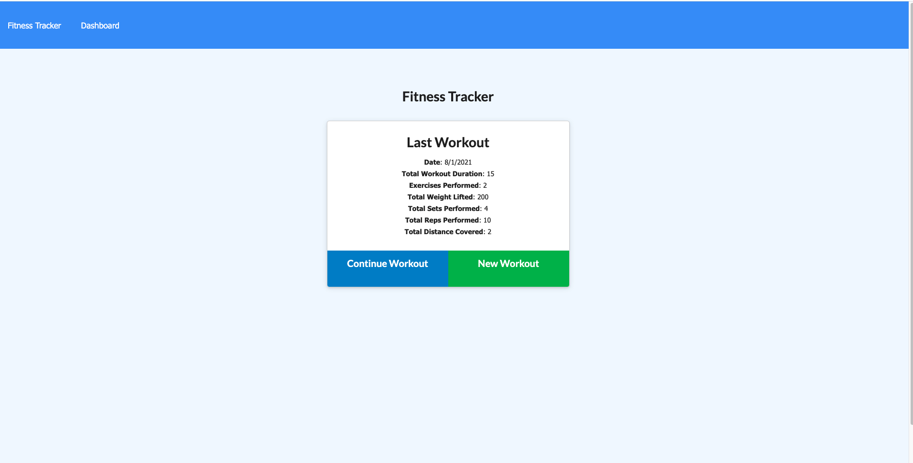

# Workout_tracker

Workout_tracker app allows its users to add exercises to the most recent workout plan, add new exercises to a new workout plan, view the total duration of 7 most recent workouts and viewe the combined weight of multiple exercises from 7 most recent workouts. 

## Getting Started

clone me, or fork me

🌎 live on [heroku](https://workout-tracker-9.herokuapp.com/?id=6106fea8d9bb810015358c10)

Screen shot of the deployed app: 

## Deployment
just deploy, no other actions needed

## Build With 

* [JavaScript (JS)](https://developer.mozilla.org/en-US/docs/Web/JavaScript)
* [Node.js](https://nodejs.dev/learn/writing-files-with-nodejs)
* [mongoDB](https://docs.mongodb.com/manual/crud/) - MongoDB CRUD Operations
* [mongoDB Atlas](https://docs.mongodb.com/realm/mongodb/)
* [heroku](https://devcenter.heroku.com/)

## License
This project is licensed under the [MIT](LICENSE) license - see the [License](LICENSE) file for details

## Acknowledgements

Billie Thompson - README template - PurpleBooth)